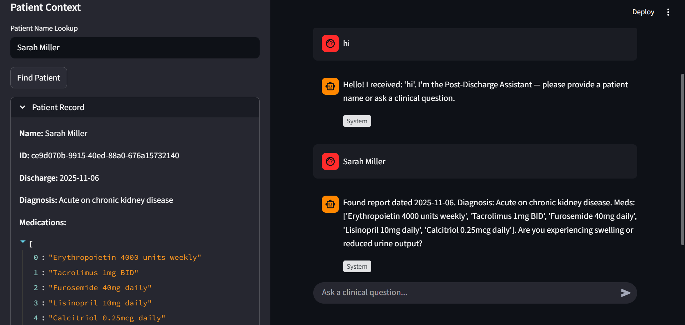
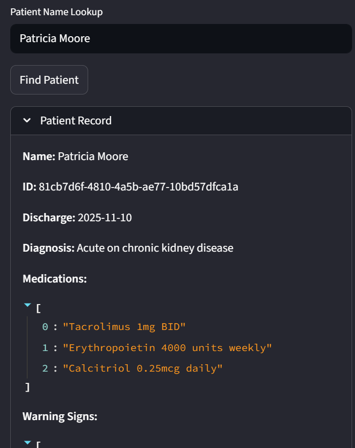

# Post-Discharge Medical AI Assistant (GenAI POC)

This is a Proof-of-Concept (POC) for a Post-Discharge Medical AI Assistant. It uses a multi-agent architecture with LangGraph, FastAPI, Streamlit, and ChromaDB to provide intelligent, context-aware responses to patients based on their discharge records and a clinical knowledge base.

## Features

- **Multi-Agent Orchestration**: Uses LangGraph to manage `ReceptionistAgent` and `ClinicalAgent` workflows.
- **RAG Pipeline**: Retrieval-Augmented Generation using ChromaDB and HuggingFace embeddings (`all-mpnet-base-v2`) to query a clinical PDF.
- **Patient Context**: SQLite database to store and retrieve patient discharge summaries.
- **Grok LLM Integration**: Wrapper for Grok API (mocked if key not present) for generation.
- **Web Search Fallback**: Stubbed web search capability for queries outside the Knowledge Base (KB).
- **Streamlit UI**: User-friendly chat interface with source citations and patient details.

## Prerequisites

- Python 3.11+
- [Optional] Grok API Key (set `GROK_API_KEY` env var)

## Setup & Installation

1. **Clone/Navigate to the repository**:
   ```bash
   cd post_discharge_ai_poc
   ```

2. **Create Environment File**:
   Copy the example environment file and add your API key:
   ```bash
   cp .env.example .env
   ```
   Then edit `.env` and add your Grok API key:
   ```
   GROK_API_KEY=your_actual_api_key_here
   ```

3. **Install Dependencies**:
   ```bash
   pip install -r requirements.txt
   ```

4. **Ingest Knowledge Base**:
   Ensure the reference PDF is available at `C:\Users\shrishti\Downloads\comprehensive-clinical-nephrology.pdf` (or update the path in the script).
   ```bash
   python scripts/ingest_reference.py
   ```
   *Note: This will create a local `chroma_db` directory.*

5. **Generate Dummy Patients**:
   Populate the SQLite database with sample patient records.
   ```bash
   python scripts/generate_dummy_patients.py
   ```

## Running the Application

1. **Start the Backend (FastAPI)**:
   ```bash
   uvicorn backend.main:app --reload --port 8000
   ```

2. **Start the Frontend (Streamlit)**:
   Open a new terminal and run:
   ```bash
   streamlit run frontend/app.py
   ```

3. **Access the App**:
   Open your browser at `http://localhost:8501`.

## Usage Guide

1. **Receptionist Flow**:
   - Enter a patient name (e.g., "John Smith") in the chat or sidebar lookup.
   - The Receptionist Agent will find the record, summarize it, and ask triage questions.
   
2. **Clinical Flow**:
   - Once a patient is identified, ask clinical questions (e.g., "I have swelling in my legs.").
   - The Clinical Agent will retrieve relevant chunks from the KB and provide an answer with citations.
   - If the answer is not in the KB, it may trigger a web search (stubbed).

## Project Structure

```
post_discharge_ai_poc/
├── backend/
│   ├── main.py              # FastAPI entry point
│   ├── langgraph_agents.py  # Agent definitions and workflow
│   ├── rag.py               # RAG pipeline (chunking, embedding, retrieval)
│   ├── patient_db.py        # SQLite database operations
│   ├── grok_wrapper.py      # Grok API wrapper (with mock)
│   └── prompts.py           # System prompts
├── frontend/
│   └── app.py               # Streamlit UI
├── scripts/
│   ├── ingest_reference.py      # PDF ingestion script
│   ├── generate_dummy_patients.py # Patient data generator
│   └── demo_clinical.py         # Demo script for clinical flow
├── tests/
│   └── test_reception_flow.py   # Test script for reception flow
├── logs/                    # Application logs
├── requirements.txt         # Python dependencies
└── README.md                # This file
```

## Configuration

- **Environment Variables**:
  - `GROK_API_KEY`: API key for Grok (optional).
  - `CHROMA_DB_DIR`: Path to ChromaDB persistence (default: `./chroma_db`).
  - `DATABASE_URL`: Path to SQLite DB (default: `patients.db`).

## Disclaimer

**This tool is for educational purposes only.** It is not intended to provide medical advice, diagnosis, or treatment. Always seek the advice of your physician or other qualified health provider with any questions you may have regarding a medical condition.

**Images**

Below are project screenshots:

- App:

   


   

   


